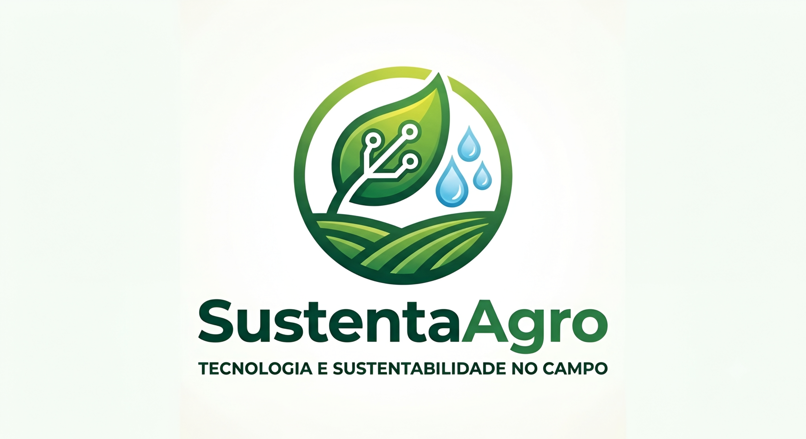

<p align="center">
  
</p>

# 🌱 SustentaAgro — Concurso Agrinho

> **Projeto idealizado e desenvolvido para o Concurso Agrinho, unindo inovação tecnológica, conscientização ecológica e as diretrizes globais de sustentabilidade no campo.**

O **SustentaAgro** é uma plataforma digital interativa concebida com o objetivo de traduzir conceitos complexos de sustentabilidade, critérios **ESG** (*Environmental, Social, and Governance*) e **Agricultura de Precisão** em uma linguagem lúdica, acessível e pedagógica para a comunidade escolar e produtores rurais.

---

## 🧑‍💻 Autoria e Realização

* **Idealizado e Desenvolvido por:** Vinicius Aparecido Barbosa
* **Instituição:** Colégio Estadual Enira Moraes Ribeiro
* **Localidade:** Paranavaí / PR
* **E-mail Escolar para Contato:** [vinicius.aparecido.barbosa@escola.pr.gov.br](mailto:vinicius.aparecido.barbosa@escola.pr.gov.br)

---

## 🚀 Funcionalidades Principais

A plataforma conta com uma série de recursos dinâmicos construídos para engajar o usuário do início ao fim da navegação:

1.  **🎬 Produção Cinemática & HQ Digital:** Central multimídia que reúne animações e uma História em Quadrinhos pedagógica exclusiva focada nas transformações e boas práticas do agronegócio moderno.
2.  **📊 Central de Conhecimento (Accordion):** Painéis interativos organizados para apresentar de forma limpa as Metas e ODS Globais, Tecnologias Sustentáveis (como gotejamento inteligente e drones) e dados estatísticos oficiais do IBGE.
3.  **🧮 Simulador de Economia Hídrica:** Uma ferramenta algorítmica onde o usuário insere a área estimada para cultivo (em Hectares) e calcula instantaneamente o impacto positivo e o volume de água preservado com técnicas modernas.
4.  **🎮 Quiz Agrinho:** Um jogo de pergunta e resposta dinâmico focado em fixar os conceitos de sustentabilidade e ganho agrícola explorados no site.

---

## ♿ Acessibilidade Digital Integrada

O projeto foi construído sob uma forte premissa de **inclusão social e acessibilidade**, contando com um widget flutuante exclusivo que oferece:
* **🔊 Leitura por Voz (Text-to-Speech):** Sintetizador de voz nativo em JavaScript para narrar blocos textuais específicos e introduções, auxiliando deficientes visuais ou leitores em fase de alfabetização.
* **🔎 Ajuste Dinâmico de Fonte:** Controle em tempo real do tamanho do texto (Aumentar, Resetar e Diminuir) sem quebrar o layout da página.
* **🌓 Alternância de Contraste:** Suporte a um modo de alto contraste para garantir conforto visual e legibilidade a usuários com baixa visão ou daltonismo.

---

## 🛠️ Tecnologias Utilizadas

O ecossistema do site foi projetado focando em performance, sem a dependência de frameworks pesados, garantindo carregamento rápido e total adaptabilidade para dispositivos móveis (Design Responsivo):

* **HTML5:** Estruturação semântica e acessível (com marcações `aria-label` e classes específicas de leitores de tela).
* **CSS3:** Estilização moderna, variáveis de ambiente para o modo contraste, layouts baseados em *Flexbox* / *Grid* e animações suaves de transição.
* **JavaScript (Vanilla):** Lógica do simulador hídrico, carrossel de imagens automatizado, sistema do Quiz, expansão dos blocos do *accordion* e motor de acessibilidade por voz.
* **Inteligência Artificial (Canva AI & Nano Banana 2):** Utilizada estritamente no suporte ao desenvolvimento e refinamento de elementos gráficos e identidade visual do projeto.

---

## ⚖️ Licença

Este projeto está licenciado sob a **Licença MIT**. Para mais detalhes, consulte o ficheiro [LICENSE] incluído na raiz deste repositório.

---

## 📂 Estrutura do Repositório

```text
├── imagens/               # Logotipos, slides do carrossel e páginas da HQ
├── videos/                # Vídeo cinemática institucional (.mp4)
├── index.html             # Estrutura principal da aplicação
├── style.css              # Toda a folha de estilos e variáveis de cores
├── script.js              # Mecanismos interativos e funções de acessibilidade
├── LICENSE                # Licença MIT do Projeto SustentaAgro
└── README.md              # Documentação oficial do projeto
